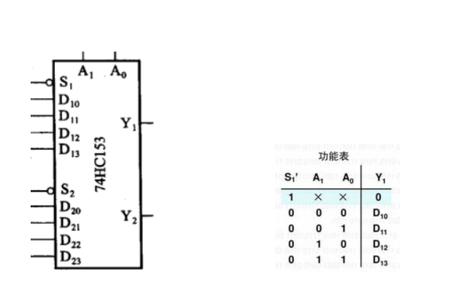
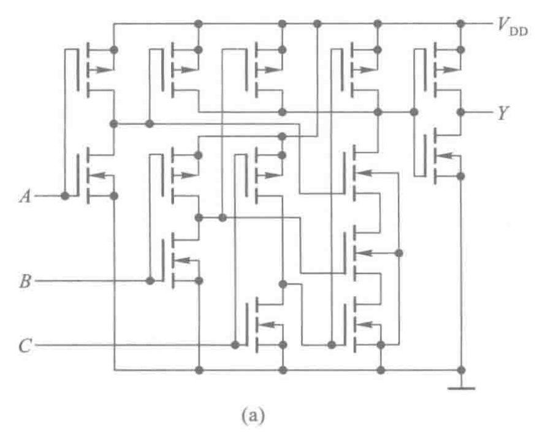
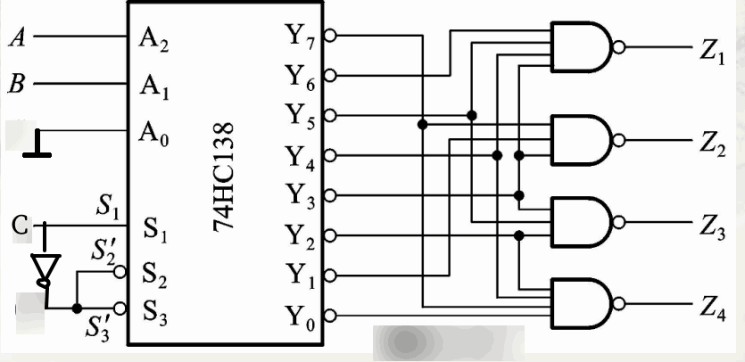
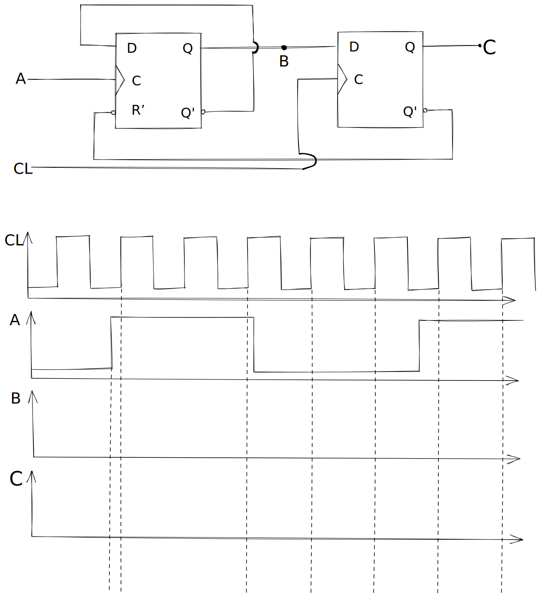

# Digital Circuits 2023-spring Midterm
>出题人：王恺  
>抄题人：贰零肆玖、喝多了萨克斯、本群唯一指定废物吕良-寄动化

<table><tr>
<td style=width:>The original file is in: 
<td style=width:28px>
</td>
<td style=width:32px> </td>
</tr></table> 

##### 1. (6points) 将31.50(o)转换为等值的十进制和十六进制数。

##### 2. (6points) 计算机中储存了一个数：1100 0011 1000。如果该数是使用 5421 码制进行编码的，且后四位为小数，那么其对应的十进制数是多少？。

##### 3. (6points) 化简 $ F(a, b, c, d, e) = a'b'c'd' + a'b'c'd + a'b'cd + a'bc'd + a'bcd + abc'd' + abc'd + abcd + ab'c'd' + ab'cd + ab'cd' + abcde $为最简与或式。

##### 4. (12points) 用卡诺图化简法将下列逻辑函数化简为最简或与式，并使用或非门搭建逻辑电路。

$ F_{(A,B,C,D)} = \sum m[0,2,5,7,8,10,13,15] $

##### 5. (30points) 有 A,B,C 三个雷达，其中 A 和 B 的功耗相同，C 的功耗是 A 的 2 倍。现通过 X,Y两个发电机向 A,B 供电，X 的最大功率和 A 的功耗相同，Y 的最大功率是 X 的 3 倍。设 A,B,C 三个雷达信号为开启(1)/关闭(0)，要求给出最节省能源的 X,Y 电动机开启(1)/关闭(0)方案。
1. 写出真值表
2. 用卡诺图化简，写出逻辑表达式
3. 用基本的“与、或、非”实现逻辑电路
4. 用一片双四选一选择器74HC153实现逻辑电路

##### 6. (20points)

1. 写出电路中 Y 关于A、B、C的逻辑表达式(5points)

1. 写出Y关于A、B、C的逻辑表达式(15points)
> 非原题，但内容相似，难度相同，有参考价值。

##### 7. 电路如图所示，触发器初始状态为0，R'=0重置清零，A、CL波形如图所示，画出B、C波形

